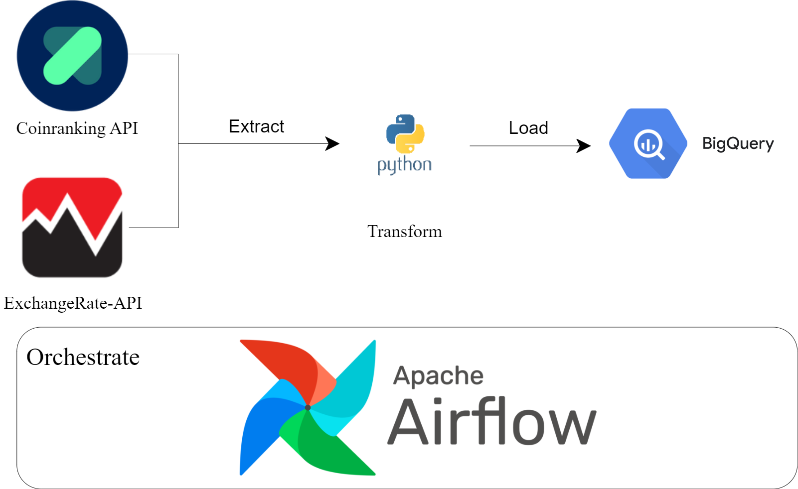

<a name="readme-top"></a>


<!-- TABLE OF CONTENTS -->
<details>
  <summary>Table of Contents</summary>
  <ol>
    <li>
      <a href="#about-the-project">About The Project</a>
      <ul>
        <li><a href="#built-with">Built With</a></li>
      </ul>
    </li>
    <li>
      <a href="#getting-started">Getting Started</a>
      <ul>
        <li><a href="#prerequisites">Prerequisites</a></li>
        <li><a href="#installation">Installation</a></li>
      </ul>
    </li>
    <li><a href="#usage">Usage</a></li>
    <li><a href="#roadmap">Roadmap</a></li>
    <li><a href="#contributing">Contributing</a></li>
    <li><a href="#license">License</a></li>
    <li><a href="#contact">Contact</a></li>
    <li><a href="#acknowledgments">Acknowledgments</a></li>
  </ol>
</details>

<!-- ABOUT THE PROJECT -->
## About The Project



An ETL project for the purpose of storing bitcoin to tl value inside of Google BigQuery without any cost.

<p align="right">(<a href="#readme-top">back to top</a>)</p>


## Built With
* [![Python][Python-url]][Python.com]
* [![Pandas][Pandas-url]][Pandas.com]
* [![Apache Airflow][Apache-Airflow-url]][Apache-Airflow.com] 
* [![Google Cloud][Google-Cloud-url]][Google-Cloud.com] 

<p align="right">(<a href="#readme-top">back to top</a>)</p>


<!-- GETTING STARTED -->
## Getting Started

This is an example of how you may give instructions on setting up your project locally.
To get a local copy up and running follow these simple example steps.

### Prerequisites 
* [Coinranking api key][Coinranking-Api]
* [Exchangerate api key][ExchangeRate-Api]
* [Valid project with a dataset in your Google Cloud account][Google-Cloud-Account]

## Installation

### [1. Ubuntu][Ubuntu-Installation]

### 2. Apache Airflow
  
  ```sh
   sudo apt-get install software-properties-common
   ```
    
  ```sh
   sudo apt-add-repository universe
   ```

  ```sh
   sudo apt-get update
   ```
 
   ```sh
   sudo apt-get install python3-pip
   ```
 
   ```sh
   pip3 install apache-airflow
   ```
   after that installation finished close the terminal and reopen it
  
   ```sh
   airflow db init
   ```
  Create a folder named "dags" inside your "airflow" folder.
   
  Create a user. An example has given below.
   ```sh
   airflow users create \
          --username admin \
          --firstname admin\
          --lastname admin \
          --role Admin \
          --email admin@example.org
   ```
   
   ```sh
   pip install pandas
   ```
   
   ```sh
   pip install pandas-gbq
   ```
   
   ```sh
   pip install --upgrade numpy
   ```
   
   ```sh
   pip install pandas-gbq
   ```


   
### [3. gcloud CLI][Gcloud-Installation]


<!-- LICENSE -->
## License

Distributed under the MIT License. See `LICENSE.txt` for more information.

<p align="right">(<a href="#readme-top">back to top</a>)</p>


<!-- CONTACT -->
## Contact

Your Name - [@your_twitter](https://twitter.com/your_username) - email@example.com

Project Link: [https://github.com/your_username/repo_name](https://github.com/your_username/repo_name)

<p align="right">(<a href="#readme-top">back to top</a>)</p>


[Python.com]: https://www.python.org/
[Python-url]: https://img.shields.io/badge/python-3670A0?style=for-the-badge&logo=python&logoColor=ffdd54
[Pandas.com]: https://pandas.pydata.org/
[Pandas-url]: https://img.shields.io/badge/pandas-%23150458.svg?style=for-the-badge&logo=pandas&logoColor=white
[Apache-Airflow.com]: https://airflow.apache.org/
[Apache-Airflow-url]: https://img.shields.io/badge/Apache%20Airflow-017CEE?style=for-the-badge&logo=Apache%20Airflow&logoColor=white
[Google-Cloud.com]: https://cloud.google.com/
[Google-Cloud-url]: https://img.shields.io/badge/GoogleCloud-%234285F4.svg?style=for-the-badge&logo=google-cloud&logoColor=white 
[Coinranking-Api]: https://developers.coinranking.com/api
[ExchangeRate-Api]: https://www.exchangerate-api.com/
[Google-Cloud-Account]: https://accounts.google.com/InteractiveLogin/signinchooser?continue=https%3A%2F%2Fconsole.cloud.google.com%2F%3Fpli%3D1&flowEntry=ServiceLogin&flowName=GlifWebSignIn&followup=https%3A%2F%2Fconsole.cloud.google.com%2F%3Fpli%3D1&ifkv=AeDOFXhWjsbeBY11W2ly6v0J4g14y8hyJrvsPjCZo1YA_ZbGDNczvu4kg5KPMsIooWofchpOhpKspA&osid=1&passive=1209600&service=cloudconsole
[Ubuntu-Installation]: https://ubuntu.com/tutorials/install-ubuntu-on-wsl2-on-windows-11-with-gui-support#2-install-wsl
[Apache-Airflow-Installation]: https://stackoverflow.com/questions/32378494/how-to-run-airflow-on-windows
[Gcloud-Installation]: https://cloud.google.com/sdk/docs/install#deb


